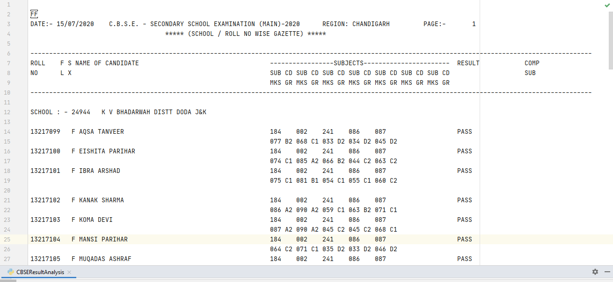
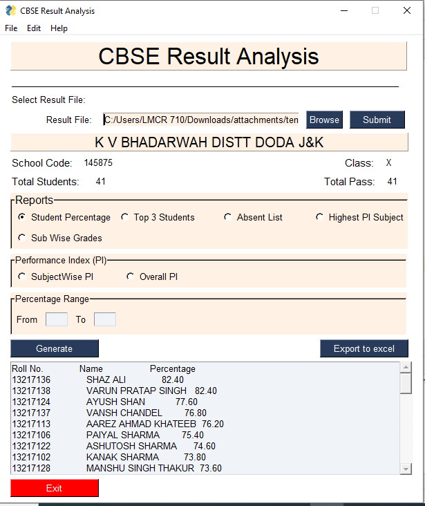

# CBSE Result Analyser

This python script helps in analysis of class 10th and 12th CBSE board result data. This script is currently used by Kendriya Vidyalaya Bhaderwah Doda Region Jammu and Kashmir for analysis of board result data obtained from CBSE. 
## Working of script
### Input
Script requires CBSE board result sheet to be selected by user as input. Sample input can be accessed from this link https://github.com/sumitsaini199711/CBSE-Result-Analyser/tree/main/Input

### Output
Script then process the input data to calculate Student Percentage,Top 3 Achievers, Absent student,Highest PI Subject,Subject Wise Grades obtained,Performace Index of particular subject and overall performace index of the class and represent the data in GUI which can further be exported to excel.

